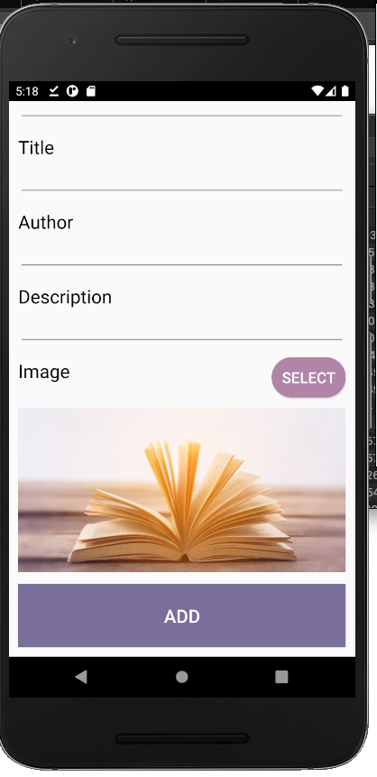
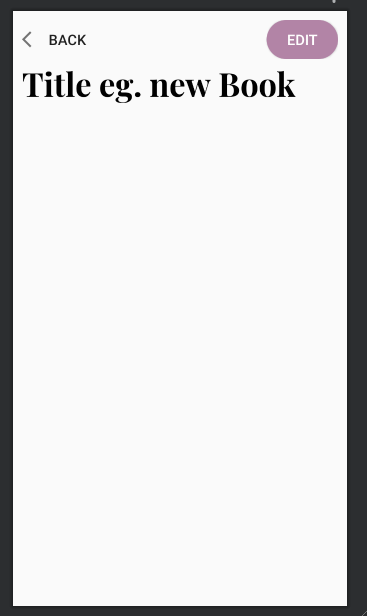
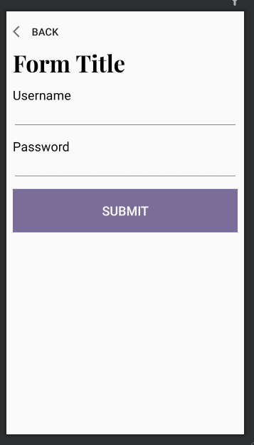

# Style Guide 

For visual consistency throughout the app, common UI elements should be styled using styles in app/res/values/styles. That way if we decide to change the look of these elements we only have to do it in one file and the changes will occur throughout the whole app. Here is a list of these styles I've already made, and when/how to use them in your layout files. **As the app grows we'll probably add more styles that can be shared, so if you make one add it here so the rest of the team can use em.**

## Buttons 

We have a lot of buttons in our app, and right now they all kinda look different. So going forward whenever you're adding a button try to choose one of these buttons to style it as. 

### Submit Button (style="@style/SubmitButton")

Whenever your activity has a main function, ie add/edit book, login, request book etc.. The button that finishes/submits this action should be a SubmitButton. To use it just set an id, text, and any gravity/centring/positional attributes you need to use to put it in the right place. Right now it's styled as a big button spanning the width of the screen (easy to press), and is our primary colour. 

For example: 

``` xml
<Button
  android:id="@+id/add_button"
  android:layout_below="@+id/form_container"
  android:text="Add"
  style="@style/SubmitButton"
  />
```

Makes this: 



### Secondary Button (style="@style/SecondaryButton")

For buttons that are not the main function of the activity there is a secondary button. This button is styled with rounded corners, and is our secondary colour.To use it just set an id, text, and any gravity/centring/positional attributes you need to use to put it in the right place. 

For example: 

``` xml
<Button
    android:id="@+id/other_button"
    android:text="Edit"
    android:layout_alignParentRight="true"
    android:layout_centerVertical="true"
    style="@style/SecondaryButton"
    />
```

Makes this: 



## Input Forms

Users enter a lot of text in a lot of views in our app, so the input forms should be consistent. Every field in a form has a label (TextView) and an input box (EditText), use the styles FormLabel and FormInput. Just set the id, text of the label, the inputType of the EditText, and any positional attributes. Also for the title of the form use the style ViewTitle. See activity_form_template.xml for a a whole form example. 

For example this: 

``` xml
<!-- Username Field Start-->
<TextView
    android:id="@+id/username_label"
    android:text="Username"
    style="@style/FormLabel"
    />

<EditText
    android:id="@+id/username_input"
    android:inputType="textPersonName"
    android:layout_below="@+id/username_label"
    style="@style/FormInput"
    />
<!--Username Field End-->
```

Defines the user name field here: 



## Book Image View (style="@style/BookImage")

Whenever a book is the focus point of a view, we should display its image consistently. This style make the image as wide as possible making it appear big and accommodate different aspect ratios. Just set its id, and positional attributes. The default src of this is the @drawable/blue_book, the only time we'd change this is programatically. 

``` xml 
<ImageView
    android:id="@+id/image"
    android:layout_below="@+id/image_label"
    style="@style/BookImage" 
    />
```


# Other Design stuff 

For other design elements that aren't necessarily styles we should be reusing code too. For example **if you ever want to display 2 choices to the user in a dialog**, use the code the SelectImageFragment. Or if **your activity is not one of the three screens on the bottom navbar of MainActivity**, always use the code in activity_blank_template.xml as a starting point, that way you have a consistent title, back button, and padding. 


