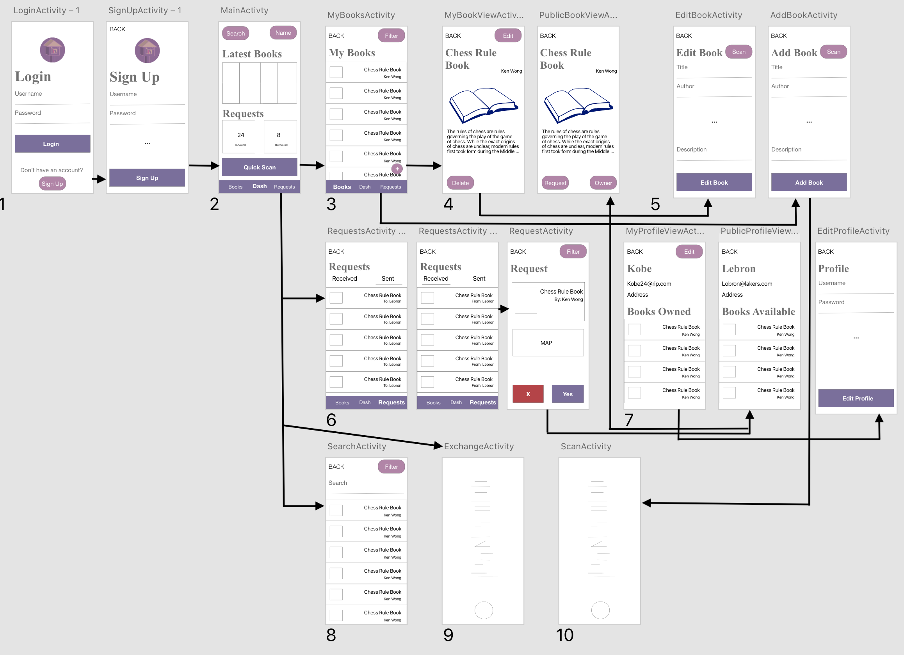

# Wireframe Mockup

## Notes for each numbered section in diagrarm: 

### 1.
User creates, or uses and already created account to login to their dashboard. (US 02.01.01)
### 2.
Dashboard to give an overview of new books posted to the platform, notifications of requests, and button to start and exchange with another user. 
### 3.
List of all user’s books that they own and have borrowed. Can filter by a number of parameters. Floating action button to add a new book. (US 01.04.01, 01.05.01) 
### 4.
Two book views, one where user can see info/status on one of their books, button to edit the book’s info, and button to delete the book. The other for user’s to see info/status on other’s books and also request the book if it’s available. (US 01.07.01, 08.03.01, 04.01.01, )
### 5.
Two Similar views for editing user’s existing books and adding a new book. User can scan the isbn to autofill text fields with the book’s info. (US 01.01.01, 01.06.01, 01.02.01, 08.01.01, 08.02.01)
### 6.
Requests list where user can view all outbound and incoming requests. Click on a request to accept/decline it, change geo-location of request, and view status. (US 04.02.01, 04.04.01, 05.01.01, 05.02.01, 05.04.01)
### 7. 
Views for user’s own profile, and other user’s public profile. Shows contact info, picture, and available books. (US 02.02.01, 02.03.01)
### 8.
Search view to search all available books, filter the search results. (US 03.01.01, 03.02.01)
### 9.
Exchange activity is for verification of exchanged books. This updates the books status according to it’s current status and the requests open for the particular book. (US 06.02.01, 06.01.01, 07.01.01, 07.02.01) 
### 10.
Scan activity is called when ever user scans an ism to get information from it. (US 01.02.01) 

